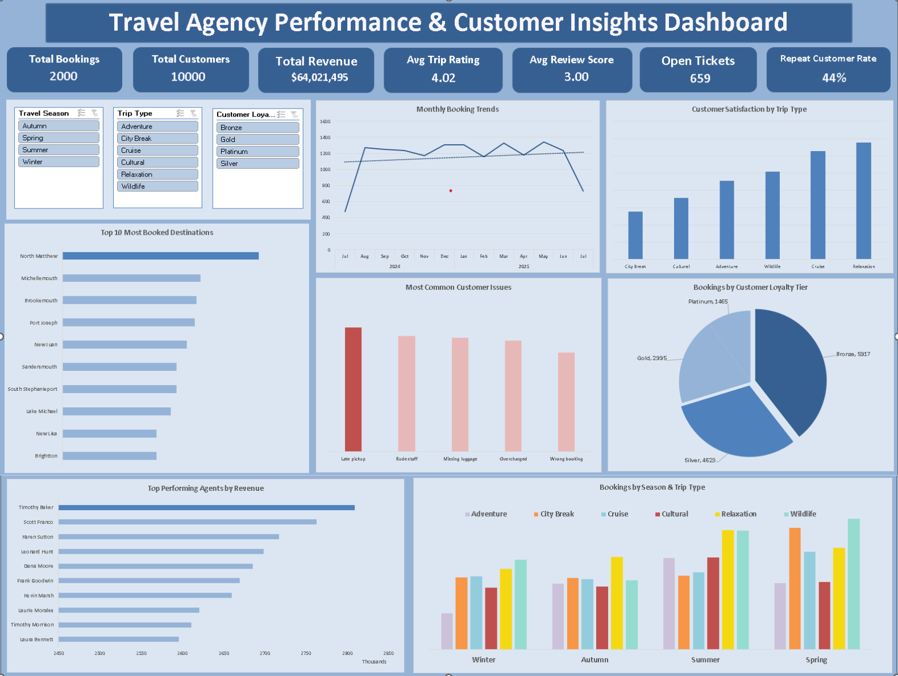

# 📊 30-Day Excel Data Analytics Challenge

**From Spreadsheet Basics to Advanced Data Modeling & Automation**  

This repository documents my **30-day Excel mastery journey**, covering real-world business scenarios—from Healthcare and Finance to E-commerce, Logistics, and Education. Each day focused on a structured skill set, gradually moving from fundamentals to advanced analytics, automation, and dashboard creation.

---

## 📚 Learning Source
This 30-Day Excel Data Analytics Challenge was based on the **30-Day Excel Challenge by Stephen Data on YouTube**. 
The exercises and real-world scenarios helped me progress from foundational skills to advanced Excel modeling, automation, and dashboard creation.

---

## 🛠️ Tools & Skills Mastered

| Category | Tools / Functions | Application |
|----------|-----------------|------------|
| Data Cleaning | Power Query (M Language), TRIM, PROPER, Remove Duplicates | Standardize text, clean messy datasets, handle missing values |
| Formulas & Logic | IF, IFS, OR, SUMIFS, COUNTIFS, VLOOKUP, HLOOKUP, INDEX/MATCH, XLOOKUP | Build calculations, automate decisions, lookup values across tables |
| Business Intelligence | Power Pivot, DAX Measures, Data Modeling (Star Schema) | Build relational models, calculate KPIs, analyze multi-table datasets |
| Visualization | PivotTables, Bar/Line/Pie/Treemap Charts, Slicers, Conditional Formatting | Highlight KPIs, create dashboards, tell stories with data |
| Automation | Macros (VBA), Dynamic Arrays (FILTER, UNIQUE, SORTBY) | Automate repetitive tasks, streamline reporting |

---

## 📅 Challenge Curriculum

### **Week 1: Foundations & Essential Logic**
- **Day 1-2:** Exploration & Formatting – Basic formulas, standardizing freelance trackers, conditional formatting.  
- **Day 3-4:** References & Sorting – Absolute vs Relative references, multi-level sorting.  
- **Day 5-6:** Visualization & Visual Cues – Bar/Line/Pie/Treemap charts, Data Bars/Icon Sets.  
- **Day 7:** Milestone Project – Expense Report using PivotTables and budget tracking.

### **Week 2: Data Aggregation & Pivot Tables**
- **Day 8:** Logical Decisions – Automating student grading and intervention flags.  
- **Day 9-10:** Text & Aggregates – Cleaning product codes, SUMIFS/COUNTIFS for operations.  
- **Day 11-12:** Pivot Table Mastery – Popular subscriptions, support ticket trends, month-over-month analysis.  
- **Day 13-14:** Data Integrity – Strict validation rules, dropdowns, and custom error alerts.

### **Week 3: Advanced Lookups & Power Query**
- **Day 15-18:** Lookup Suite – VLOOKUP, HLOOKUP, INDEX/MATCH, XLOOKUP for medical, warehouse, and logistics datasets.  
- **Day 19:** Pro-Level Cleaning – Duplicate removal, casing standardization, helper columns.  
- **Day 20-21:** Power Query ETL – Unpivoting, Fill Down, transforming survey & asset data (1,500+ records).

### **Week 4: Professional Modeling & Automation**
- **Day 22-23:** Data Storytelling – Dynamic Arrays (SORTBY, TAKE) to extract insights from adoption data.  
- **Day 24-25:** Power Pivot & DAX – Relational data model creation, multi-table KPI measures.  
- **Day 26-27:** Auditing & Macros – Automatically flag missing/duplicate/outlier data.  
- **Day 28:** Data Entry Forms – Front-end interface with automated Submit/Clear functions.  
- **Day 29:** Keyboard Mastery – Advanced shortcuts for speed and efficiency.  

### **🏆 Capstone Project: Travel Agency Operations**
- **Scenario:** Analyze global travel bookings and customer feedback.  
- **Process:** Cleaned messy trip logs, correlated loyalty tiers with bookings, and flagged recurring support issues.  
- **Outcome:** Built a dynamic Excel dashboard for revenue by agent and region, with predictive forecasting for next-quarter bookings and automated satisfaction tracking.

---

## 📖 Summary Article
A detailed article summarizing my 30-day Excel learning journey, including key insights, challenges, and real-world applications, will be published soon.  

---

## 📂 Repository Structure
- Each file represents a **daily practice workbook** (Day01 → Day30).  
- Each workbook contains:  
  - **Dataset** – The original data provided for the exercise  
  - **Practice Work** – My step-by-step analysis and transformations  
  - **Final Output** – Completed calculations, charts, PivotTables, or dashboards  